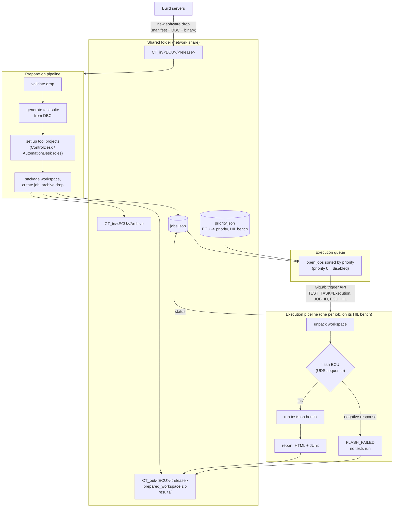
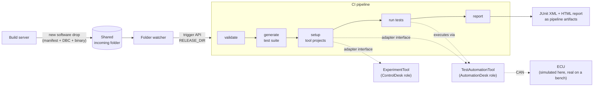

# HIL Test Automation Pipeline

**From a new ECU software drop to flashed, tested ECUs and a report, with no manual steps.**

A runnable model of a CI/CD toolchain for Hardware-in-the-Loop (HIL) testing of
automotive ECUs. Build servers drop new software into a shared folder; the pipeline
**prepares** a test workspace per ECU, puts the jobs into a **priority queue**, and
starts one **execution** per job on the right HIL bench: flash the ECU, run the
tests only if flashing succeeded, publish the results.

It mirrors the architecture of a production system I designed and built over three
years in GitLab CI for a fleet of dSPACE HIL benches (18 ECU types). The dSPACE
tools, benches and ECUs are replaced here by **mock tool adapters**, a **simulated
UDS flash** and a **simulated ECU on a virtual CAN bus**, so anyone can run it in
seconds. All code is new; no proprietary code, data or tool APIs are included.

```bash
pip install -r requirements.txt
python -m hil_pipeline demo        # 3 ECUs: prepare -> priority queue -> flash + test
```

```
| ECU          | Software            | Priority | HIL   | Preparation | Testing      |
|--------------|---------------------|----------|-------|-------------|--------------|
| BODY_DEMO    | BODY_DEMO_v2.0.0    | 1        | HIL-2 | OK          | PASSED       |
| ECU_DEMO     | ECU_DEMO_v1.1.0     | 2        | HIL-1 | OK          | FAILED       |
| GATEWAY_DEMO | GATEWAY_DEMO_v3.0.0 | 3        | HIL-3 | OK          | FLASH_FAILED |
```

*The body controller passes, the engine ECU's regression is caught (a message sent
too slowly and an out-of-range temperature), and the gateway rejects the download
during flashing, so its tests are never started.*

## Multi-ECU architecture



| Stage | Command | What it does |
|---|---|---|
| Prepare | `python -m hil_pipeline prepare <share>` | every new drop in `CT_in`: validate, generate tests, set up projects, zip the workspace to `CT_out`, add a job (`PREPARATION_STATUS=OK`, `TESTING_STATUS=NT`), archive the drop |
| Queue | `python -m hil_pipeline queue <share> [--mode gitlab]` | open jobs in priority order; `local` executes them here, `gitlab` triggers one execution pipeline per job via the trigger API |
| Execute | `python -m hil_pipeline execute <share> --job <id>` | unpack, flash (UDS: 0x10, 0x27, 0x31, 0x34, 0x36, 0x37, 0x11), test only after a successful flash, publish to `CT_out` |
| Status | `python -m hil_pipeline status <share>` | job table |

Design points carried over from the production system:

* **Folder-based handoff** between build servers and the test system (`CT_in` / `CT_out`),
  with archiving, so neither side needs to know the other's internals.
* **Preparation decoupled from execution**: workspaces are prepared once, centrally,
  and executed later on whichever bench is free; benches only need the zip.
* **Priority queue** in a plain JSON file that test managers can edit; priority 0
  takes an ECU out of the queue without touching the pipeline.
* **Flash gate**: a failed flash marks the job `FLASH_FAILED` and skips the tests,
  so a broken download never produces misleading test failures.
* **Tool adapters** behind interfaces (`tools/base.py`), so the same pipeline runs
  with mocks in the cloud and with the real dSPACE tools on a bench PC.

## Single-release pipeline

The stages inside preparation and execution can also run for one release on its
own, which is how the rest of this README demonstrates them.


### Stages for one release



| Production setup | In this demo |
|---|---|
| Build server copies the release to a network share | Release folders in `examples/` or any `incoming/` folder |
| Watcher triggers a GitLab pipeline | `hil_pipeline watch --mode gitlab` (calls the trigger API) or `--mode local` |
| GitLab runners on the Windows PCs at the HIL benches | Any Docker runner / GitHub Actions |
| ControlDesk & AutomationDesk driven via COM automation | `tools/mock.py`; real adapters plug in at `tools/dspace_com.py` |
| ECU on a dSPACE simulator, real CAN bus | `sim/ecu_sim.py` on a `python-can` virtual bus |

## Quick start

```bash
python -m venv .venv && source .venv/bin/activate      # Windows: .venv\Scripts\activate
pip install -r requirements-dev.txt

# a healthy release: 12/12 tests pass
python -m hil_pipeline run examples/ECU_DEMO_v1.0.0

# a release with a regression: the pipeline fails (exit code 1)
python -m hil_pipeline run examples/ECU_DEMO_v1.1.0

open build/ECU_DEMO_v1.1.0/report.html               # Windows: start ...
```

Output of the failing release:

```
[validate] ECU_DEMO_v1.1.0: manifest and CAN database OK (ecu.dbc)
[generate] 12 tests -> build/ECU_DEMO_v1.1.0/test_suite.yaml {'presence': 3, 'cycle_time': 3, 'signal_range': 6}
[setup] mock-experiment-tool: build/ECU_DEMO_v1.1.0/projects/ECU_DEMO_v1.1.0_Experiment.json
[setup] mock-test-automation-tool: build/ECU_DEMO_v1.1.0/projects/ECU_DEMO_v1.1.0_TestProject (suite imported)
[test] 10/12 passed
[test]   FAIL CYC_CCVS_Demo: mean 130.0 ms, expected 100 ms +/-10% (90-110 ms)
[test]   FAIL RNG_EngineCoolantTemp: observed 215 to 215 degC, allowed -40 to 210
```

### Watch a folder, like the real setup

```bash
mkdir -p releases/incoming
python -m hil_pipeline watch releases/incoming            # in one terminal
cp -r examples/ECU_DEMO_v1.1.0 releases/incoming/         # in another: "deliver" software
```

A drop is only picked up once its `manifest.yaml` exists and nothing in the
folder has changed for a few seconds, so half-copied releases are ignored.
Each release is processed once (tracked in `incoming/.processed.json`).

To trigger GitLab instead of running locally, create a pipeline trigger token
and run:

```bash
export GITLAB_URL=https://gitlab.example.com GITLAB_PROJECT=group/hil-pipeline \
       GITLAB_TRIGGER_TOKEN=... GITLAB_REF=main
python -m hil_pipeline watch /path/to/share/incoming --mode gitlab
```

## What a software drop looks like

```
ECU_DEMO_v1.1.0/
├── manifest.yaml   # ECU name, version, CAN database, test settings
└── ecu.dbc         # CAN database of this software version
```

The test suite is **derived from the DBC**, so when a release adds or changes a
message, the tests follow automatically:

| Test | Generated for | Checks |
|---|---|---|
| `PRES_<message>` | every message | the ECU sends it at all |
| `CYC_<message>` | messages with `GenMsgCycleTime` | mean cycle time within the tolerance |
| `RNG_<signal>` | signals with a physical range | every received value within [min, max] |

The demo's `sim_faults` section in the manifest lets a release behave like a
buggy build (slow message, out-of-range signal), so you can see the pipeline catch it.

## CI

* **`.gitlab-ci.yml`**: two pipeline types in one project, selected by `TEST_TASK`.
  *Preparation* (`check → prepare → queue`) prepares all new drops and queues them;
  with a trigger token configured, the queue starts one *Execution* pipeline per job
  (`TEST_TASK=Execution`, `JOB_ID`, `ECU`, `HIL`), which a runner on the matching HIL
  bench picks up by tag. JUnit results appear in GitLab's test tab. For real benches:
  register a shell runner on each Windows HIL PC, tag it with its bench name, point
  `HIL_SHARE` at the network share and set `HIL_TOOL_BACKEND=dspace`.
* **`.github/workflows/pipeline.yml`**: runs the unit tests, both single releases and
  the three-ECU demo on GitHub Actions, checks every result and writes the job table
  to the run summary.

## Plugging in real tools

`hil_pipeline/tools/base.py` defines the two interfaces the pipeline uses.
`tools/dspace_com.py` is where implementations against the dSPACE ControlDesk /
AutomationDesk COM automation APIs go (Windows only, `pywin32`). The specific
COM calls depend on the installed dSPACE release, so they are intentionally left
to be filled in from that release's API documentation. Nothing else in the
pipeline changes.

## Project layout

```
hil_pipeline/
  release.py        read + validate a software drop
  watcher.py        watch the incoming folder, trigger local run or GitLab pipeline
  testgen.py        DBC -> test suite
  pipeline.py       the five stages for one release
  orchestrator.py   multi-ECU: shared folder, prepare -> priority queue -> execute
  flash.py          UDS-style flash step and the flash gate
  runner.py         record bus traffic, evaluate tests
  report.py         JUnit XML + HTML report
  tools/            tool-adapter interfaces, mock + dSPACE adapters
  sim/ecu_sim.py    simulated ECU on a virtual CAN bus
examples/           ECU_DEMO v1.0.0 (healthy) and v1.1.0 (regression),
                    BODY_DEMO v2.0.0 (healthy), GATEWAY_DEMO v3.0.0 (flash failure)
tests/              pytest suite
```

## Tech

Python 3.10+ · GitLab CI (trigger API, multi-pipeline) · UDS flashing · python-can · cantools · matplotlib · GitHub Actions ·
CAN / SAE J1939-style messages (all demo values invented).

## Licence

MIT, see [LICENSE](LICENSE).
