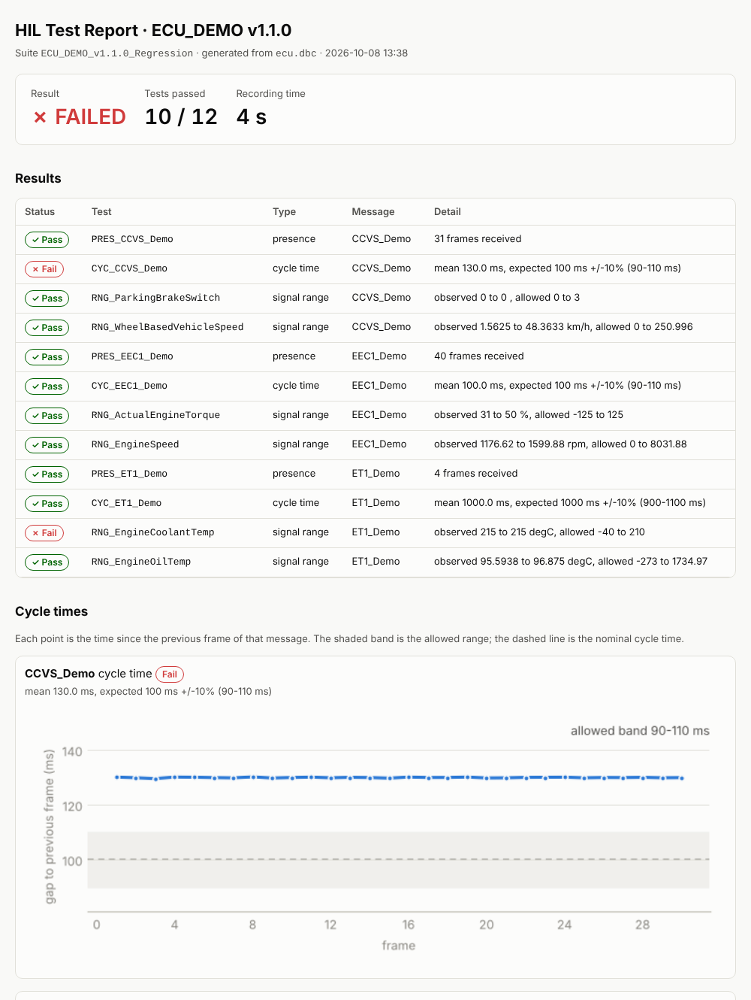
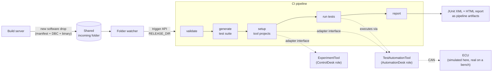

# HIL Test Automation Pipeline

**From a new ECU software drop to a test report, with no manual steps.**

This repository is a small, runnable model of a Hardware-in-the-Loop (HIL) test
toolchain automated with CI/CD. When a new software release lands in a shared
folder, a watcher triggers the pipeline, which

1. **validates** the software drop,
2. **generates a test suite** from the release's CAN database (DBC),
3. **sets up the tool projects**: an experiment/instrumentation project (the role of
   dSPACE ControlDesk) and a test-automation project with the suite imported
   (the role of dSPACE AutomationDesk),
4. **runs the tests** against the ECU, and
5. **publishes a report** (HTML + JUnit XML for the CI test view).

It mirrors the architecture of a production pipeline I built in GitLab for
dSPACE HIL benches. The real tools and ECUs are replaced by **mock tool adapters**
and a **simulated ECU on a virtual CAN bus**, so anyone can run it in a minute.
No proprietary code, data or tool APIs are included.



## Architecture



| Production setup | In this demo |
|---|---|
| Build server copies the release to a network share | Release folders in `examples/` or any `incoming/` folder |
| Watcher triggers a GitLab pipeline | `hil_pipeline watch --mode gitlab` (calls the trigger API) or `--mode local` |
| GitLab runners on the Windows PCs at the HIL benches | Any Docker runner / GitHub Actions |
| ControlDesk & AutomationDesk driven via COM automation | `tools/mock.py`; real adapters plug in at `tools/dspace_com.py` |
| ECU on a dSPACE simulator, real CAN bus | `sim/ecu_sim.py` on a `python-can` virtual bus |

## Quick start

```bash
python -m venv .venv && source .venv/bin/activate      # Windows: .venv\Scripts\activate
pip install -r requirements-dev.txt

# a healthy release: 12/12 tests pass
python -m hil_pipeline run examples/ECU_DEMO_v1.0.0

# a release with a regression: the pipeline fails (exit code 1)
python -m hil_pipeline run examples/ECU_DEMO_v1.1.0

open build/ECU_DEMO_v1.1.0/report.html               # Windows: start ...
```

Output of the failing release:

```
[validate] ECU_DEMO_v1.1.0: manifest and CAN database OK (ecu.dbc)
[generate] 12 tests -> build/ECU_DEMO_v1.1.0/test_suite.yaml {'presence': 3, 'cycle_time': 3, 'signal_range': 6}
[setup] mock-experiment-tool: build/ECU_DEMO_v1.1.0/projects/ECU_DEMO_v1.1.0_Experiment.json
[setup] mock-test-automation-tool: build/ECU_DEMO_v1.1.0/projects/ECU_DEMO_v1.1.0_TestProject (suite imported)
[test] 10/12 passed
[test]   FAIL CYC_CCVS_Demo: mean 130.0 ms, expected 100 ms +/-10% (90-110 ms)
[test]   FAIL RNG_EngineCoolantTemp: observed 215 to 215 degC, allowed -40 to 210
```

### Watch a folder, like the real setup

```bash
mkdir -p releases/incoming
python -m hil_pipeline watch releases/incoming            # in one terminal
cp -r examples/ECU_DEMO_v1.1.0 releases/incoming/         # in another: "deliver" software
```

A drop is only picked up once its `manifest.yaml` exists and nothing in the
folder has changed for a few seconds, so half-copied releases are ignored.
Each release is processed once (tracked in `incoming/.processed.json`).

To trigger GitLab instead of running locally, create a pipeline trigger token
and run:

```bash
export GITLAB_URL=https://gitlab.example.com GITLAB_PROJECT=group/hil-pipeline \
       GITLAB_TRIGGER_TOKEN=... GITLAB_REF=main
python -m hil_pipeline watch /path/to/share/incoming --mode gitlab
```

## What a software drop looks like

```
ECU_DEMO_v1.1.0/
├── manifest.yaml   # ECU name, version, CAN database, test settings
└── ecu.dbc         # CAN database of this software version
```

The test suite is **derived from the DBC**, so when a release adds or changes a
message, the tests follow automatically:

| Test | Generated for | Checks |
|---|---|---|
| `PRES_<message>` | every message | the ECU sends it at all |
| `CYC_<message>` | messages with `GenMsgCycleTime` | mean cycle time within the tolerance |
| `RNG_<signal>` | signals with a physical range | every received value within [min, max] |

The demo's `sim_faults` section in the manifest lets a release behave like a
buggy build (slow message, out-of-range signal), so you can see the pipeline catch it.

## CI

* **`.gitlab-ci.yml`**: one job per stage (`validate → generate → setup → test → report`).
  The `build/` folder is passed between jobs as an artifact, JUnit results show up
  in GitLab's test tab, and the HTML report is exposed in the merge request.
  For real benches: register a runner on the Windows HIL PC, add its tags and set
  `HIL_TOOL_BACKEND=dspace`.
* **`.github/workflows/pipeline.yml`**: the same flow on GitHub Actions; runs both
  example releases and checks that the healthy one passes and the regression is caught.

## Plugging in real tools

`hil_pipeline/tools/base.py` defines the two interfaces the pipeline uses.
`tools/dspace_com.py` is where implementations against the dSPACE ControlDesk /
AutomationDesk COM automation APIs go (Windows only, `pywin32`). The specific
COM calls depend on the installed dSPACE release, so they are intentionally left
to be filled in from that release's API documentation. Nothing else in the
pipeline changes.

## Project layout

```
hil_pipeline/
  release.py        read + validate a software drop
  watcher.py        watch the incoming folder, trigger local run or GitLab pipeline
  testgen.py        DBC -> test suite
  pipeline.py       the five stages
  runner.py         record bus traffic, evaluate tests
  report.py         JUnit XML + HTML report
  tools/            tool-adapter interfaces, mock + dSPACE adapters
  sim/ecu_sim.py    simulated ECU on a virtual CAN bus
examples/           two releases: v1.0.0 (healthy), v1.1.0 (regression)
tests/              pytest suite
```

## Tech

Python 3.10+ · python-can · cantools · matplotlib · GitLab CI · GitHub Actions ·
CAN / SAE J1939-style messages (all demo values invented).

## Licence

MIT, see [LICENSE](LICENSE).
